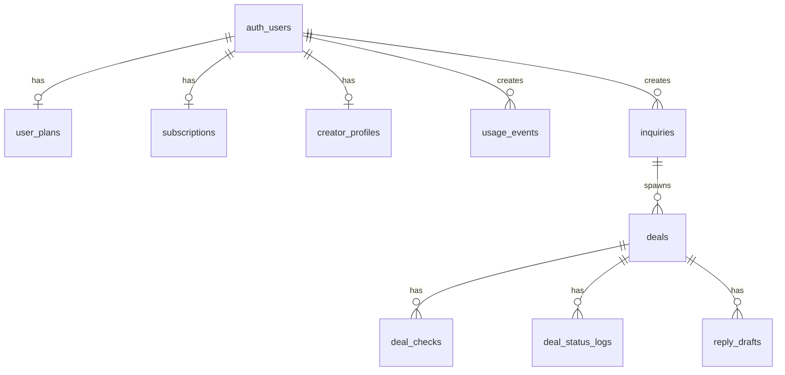
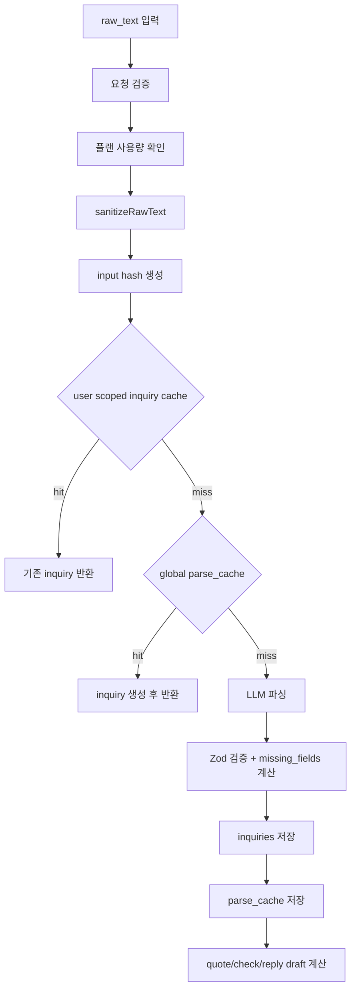

# DELO | 크리에이터 브랜디드 딜 운영 AI


DELO는 크리에이터가 브랜드 협업 문의를 입력하면 조건 정리, 견적 산출, 체크리스트 생성, 답장 초안 작성, 딜 저장과 진행 추적까지 한 번에 처리하도록 만든 Next.js SaaS입니다.

---

## 목차

1. [서비스 개요](#1-서비스-개요)
2. [기술 스택](#2-기술-스택)
3. [아키텍처 다이어그램](#3-아키텍처-다이어그램)
4. [디렉터리 구조](#4-디렉터리-구조)
5. [데이터 모델 (ERD)](#5-데이터-모델-erd)
6. [핵심 플로우 상세](#6-핵심-플로우-상세)
7. [API 인터페이스](#7-api-인터페이스)
8. [플랜 정책](#8-플랜-정책)
9. [로컬 개발 셋업](#9-로컬-개발-셋업)
10. [환경변수 인터페이스](#10-환경변수-인터페이스)
11. [테스트 가이드](#11-테스트-가이드)
12. [배포](#12-배포)
13. [코드 작성 규칙 가이드](#13-코드-작성-규칙-가이드)
14. [현재 상태 / 로드맵](#14-현재-상태--로드맵)

---

## 1. 서비스 개요

### 무엇을 해결하는가

브랜드 협업 문의를 받은 크리에이터는 보통 아래 일을 수동으로 반복합니다.

- 이메일/DM의 긴 텍스트에서 조건을 다시 정리
- 빠진 계약 항목과 리스크를 직접 확인
- 팔로워/조회수/플랫폼에 맞는 견적 범위를 감으로 계산
- 답장 문구를 매번 새로 작성
- 저장된 딜의 상태, 후속 액션, 미응답 건을 따로 추적

DELO는 이 반복 업무를 다음 워크플로우로 압축합니다.

1. 문의 원문 입력
2. AI 구조화 파싱
3. 서버 계산 기반 견적/체크리스트/답장 초안 생성
4. 딜 저장
5. 대시보드에서 상태 전이와 후속 일정 관리

### 현재 구현된 사용자 가치

| 영역 | 현재 동작 |
|------|------|
| 문의 파싱 | 이메일, DM, 기타 텍스트를 구조화된 문의 데이터로 변환 |
| 견적 산출 | 크리에이터 프로필과 문의 내용을 바탕으로 floor / target / premium 계산 |
| 체크리스트 | 사용권, 수정 횟수, 독점 여부, 지급 조건 등 리스크 항목 생성 |
| 답장 초안 | Free는 polite 1종, Standard는 polite / quick / negotiation 3종 제공 |
| 협상 AI | Standard 전용 AI 협상 답장 생성, 실패 시 템플릿 fallback |
| 딜 관리 | Lead ~ Paid / ClosedLost 상태 추적, next action / due date 관리 |
| 알림 | Standard 전용 대시보드 alerts + 7일 이상 미응답 딜 이메일 알림 |
| 계정 설정 | 닉네임 변경, 비밀번호 재설정, 계정 삭제, 구독 상태 확인 |

### 대상 사용자

| 항목 | 설명 |
|------|------|
| 핵심 사용자 | 브랜드 협업을 직접 처리하는 1인 크리에이터 |
| 주 채널 | 이메일, 인스타그램 DM, 기타 메신저/커뮤니티 메시지 |
| 문제 강도 | 협업이 월 단위로 누적되면서 견적/계약/후속 관리가 분산되는 경우 |

### 플랜 구조

| 플랜 | 가격 | 상태 |
|------|------|------|
| Free | 0원 | 구현 완료 |
| Standard | 월 12,900원 | 구현 완료 |

---

## 2. 기술 스택

| 레이어 | 기술 | 용도 |
|------|------|------|
| 프레임워크 | Next.js 15 App Router | 페이지, API Route, SSR/RSC |
| UI | React 19, TypeScript 5.8, Tailwind CSS | 프론트엔드 |
| 인증/DB | Supabase Auth, PostgreSQL | 세션, 사용자 데이터, 딜 저장 |
| 배포 | Cloudflare Workers + OpenNext | 메인 운영 배포 |
| 보조 배포 설정 | Vercel | 대체 배포 설정 및 cron 정의 참고 |
| 결제 | Polar | Standard 구독 결제와 웹훅 동기화 |
| LLM | OpenAI, Google Gemini, Anthropic | 문의 파싱, 협상 답장 생성 |
| 이메일 | Resend | 미응답 딜 알림 메일 |
| 분석/모니터링 | PostHog, Sentry | 이벤트 추적, 에러 모니터링 |
| 테스트 | Vitest | 서비스/라우트 단위 테스트 |

### 현재 모델 정책

`lib/llm/registry.ts` 기준:

- `parse_inquiry`: primary `gpt-4o-mini`, fallback `gemini-2.5-flash-lite`
- `reply_negotiation`: primary `gpt-4o-mini`, fallback `claude-sonnet-4-6`

### 참고

- `package.json`에는 `stripe` 패키지가 남아 있지만 현재 결제 구현은 Polar 기준입니다.
- 분석 이벤트는 `lib/analytics-contract.ts`에서 단일 소스로 관리하며 현재 33개 이벤트 이름이 정의돼 있습니다.

---

## 3. 아키텍처 다이어그램

### 전체 구조

```text
Browser / Mobile
  -> Next.js App Router
    -> Route Handlers (/app/api/*)
    -> Server Components
    -> Client Components
  -> Service Layer (services/*)
  -> Repository Layer (repositories/*)
  -> Supabase Postgres + Auth

External integrations
  - OpenAI / Gemini / Anthropic
  - Polar
  - Resend
  - PostHog
  - Sentry
```

### 계층 규칙

```text
API Route
  -> 인증, 요청 검증, 플랜 게이트
Service
  -> 비즈니스 로직
Repository
  -> Supabase admin client 기반 DB 접근
Database
  -> 실제 저장소
```

규칙:

- 클라이언트가 계산한 견적/체크/플랜 플래그는 신뢰하지 않습니다.
- 플랜 제한은 `lib/plan-policy.ts`를 단일 소스로 사용합니다.
- DB 접근은 repository에 모으고 서비스는 저장 방식 세부 구현을 알지 않도록 유지합니다.

---

## 4. 디렉터리 구조

```text
creator-deal-copilot/
├─ app/
│  ├─ api/
│  │  ├─ account/                    # 계정 삭제
│  │  ├─ account/check-nickname/     # 닉네임 중복 확인
│  │  ├─ analytics/event/            # 클라이언트 이벤트 수집
│  │  ├─ billing/checkout/           # Polar checkout URL 생성
│  │  ├─ billing/webhook/            # Polar webhook
│  │  ├─ creator-profile/            # 프로필 조회/저장
│  │  ├─ cron/unanswered-alert/      # 미응답 딜 알림 메일
│  │  ├─ deals/                      # 딜 목록/생성
│  │  ├─ deals/[id]/                 # 딜 상세/수정
│  │  ├─ deals/alerts/               # 알림 목록
│  │  ├─ demo/parse/                 # 비로그인 데모 파싱
│  │  ├─ inquiries/                  # 문의 목록/상세
│  │  ├─ inquiries/parse/            # 핵심 파싱 엔드포인트
│  │  └─ replies/negotiation-ai/     # Standard 협상 답장 AI
│  ├─ dashboard/                     # 인증 사용자 워크스페이스
│  ├─ auth/reset-password/           # 비밀번호 재설정 화면
│  ├─ login/, signup/, onboarding/
│  ├─ parse/                         # 파싱 체험/입력
│  ├─ privacy/, terms/, about/, how-it-works/
│  └─ page.tsx                       # 랜딩 페이지
├─ components/
│  ├─ dashboard/
│  ├─ inquiry/
│  ├─ intake/
│  ├─ landing/
│  ├─ results/
│  ├─ settings/
│  └─ ui/
├─ services/                         # 비즈니스 로직
├─ repositories/                     # DB 접근
├─ lib/                              # 공통 유틸, analytics, llm, supabase, polar
├─ schemas/                          # zod schema
├─ types/
├─ supabase/migrations/              # 001 ~ 010
├─ __tests__/                        # 27개 테스트 파일
├─ public/
├─ wrangler.jsonc
├─ open-next.config.ts
└─ vercel.json
```

---

## 5. 데이터 모델 (ERD)

핵심 테이블 관계는 아래와 같습니다.



### 주요 테이블

| 테이블 | 역할 |
|------|------|
| `creator_profiles` | 팔로워/조회수/플랫폼/최저 단가 등 견적 계산 기준 |
| `inquiries` | 파싱 결과와 누락 필드 저장 |
| `parse_cache` | 입력 해시 기반 글로벌 파싱 캐시 |
| `deals` | 실제 저장된 협업 딜 |
| `deal_checks` | 리스크/체크리스트 |
| `reply_drafts` | 생성된 답장 초안 |
| `deal_status_logs` | 상태 전이 이력 |
| `user_plans` | 현재 플랜 |
| `subscriptions` | Polar 동기화 결과 |
| `usage_events` | 플랜 사용량 집계용 이벤트 |

### 마이그레이션 상태

현재 저장소에는 `supabase/migrations/001_create_deal_tables.sql`부터 `010_add_deal_notified_at.sql`까지 포함돼 있습니다.

최근 반영된 스키마 성격:

- `subscriptions` 테이블 도입
- Stripe 명칭을 Polar 기준으로 치환
- creator profile 확장
- `reply_drafts` 저장
- `deals.notified_at` 추가로 알림 중복 발송 방지

---

## 6. 핵심 플로우 상세

### 6-A. Parse Pipeline

`POST /api/inquiries/parse`



핵심 포인트:

- 입력은 최대 10,000자까지만 사용합니다.
- 해시는 `sanitized_text + source_type + prompt_version` 기준으로 생성합니다.
- 사용자별 캐시와 글로벌 캐시 두 단계를 둡니다.
- 파싱 후 즉시 견적, 체크리스트, 답장 초안을 함께 응답합니다.
- Free는 전체 견적 breakdown과 체크리스트를 숨기고 축약 응답만 받습니다.

### 6-B. Deal 저장과 상태 전이

`POST /api/deals`

1. 인증 확인
2. `SAVE_DEAL` 플랜 제한 확인
3. `inquiry_id` 또는 `raw_text + source_type` 기준으로 parse result 확보
4. `buildDealPayload()`에서 견적/체크/답장 초안 계산
5. `deals`, `deal_checks`, `reply_drafts` 저장
6. 사용량 이벤트 기록

상태 전이는 `services/status-transition.ts`의 허용 규칙만 따릅니다.

```text
Lead -> Replied -> Negotiating -> Confirmed -> Delivered -> Paid
Lead/Replied/Negotiating -> ClosedLost
```

### 6-C. Billing (Polar)

`POST /api/billing/checkout`

- 로그인 사용자의 이메일과 user id를 Polar checkout metadata에 넣어 hosted checkout URL을 생성합니다.

`POST /api/billing/webhook`

- Polar 서명을 검증합니다.
- `subscription.created`, `subscription.updated`, `subscription.revoked`를 처리합니다.
- `subscriptions` upsert 후 `user_plans`를 `free` 또는 `standard`로 동기화합니다.

### 6-D. 인증과 미들웨어

`middleware.ts`

- Supabase 세션을 refresh합니다.
- `/dashboard`, `/settings`, `/onboarding` 경로를 보호합니다.
- 비로그인 사용자는 `/login`으로 리다이렉트됩니다.

### 6-E. 미응답 딜 알림 Cron

`GET /api/cron/unanswered-alert`

조건:

- `Authorization: Bearer $CRON_SECRET`
- `user_plans.plan = standard`
- `deals.status = Lead`
- 생성 후 7일 이상 경과
- `notified_at IS NULL`

처리:

1. 대상 딜 조회
2. 사용자별로 묶기
3. Resend로 메일 발송
4. 성공 건은 `notified_at` 업데이트

### 6-F. 계정/설정 플로우

최근 구현 범위:

- `/dashboard/settings/profile`
  - 닉네임 변경
  - 이메일 계정의 비밀번호 변경
  - 계정 삭제
- `/dashboard/settings/billing`
  - 현재 플랜/구독 상태 확인
  - Standard 업그레이드 CTA
- `/auth/reset-password`
  - OTP/code 기반 비밀번호 재설정

---

## 7. API 인터페이스

### 주요 엔드포인트

| 메서드 | 경로 | 설명 |
|------|------|------|
| `GET` | `/api/health` | 헬스체크 |
| `POST` | `/api/demo/parse` | 비로그인 데모 파싱 |
| `POST` | `/api/inquiries/parse` | 파싱 + 견적/체크/답장 초안 반환 |
| `GET` | `/api/inquiries` | 문의 목록 |
| `GET` | `/api/inquiries/[id]` | 문의 상세 |
| `GET` | `/api/deals` | 딜 목록 + alerts 요약 |
| `POST` | `/api/deals` | 딜 저장 |
| `GET` | `/api/deals/[id]` | 딜 상세, checks, drafts, status logs |
| `PATCH` | `/api/deals/[id]` | 상태/메모/후속 일정 수정 |
| `GET` | `/api/deals/alerts` | Standard 알림 목록 |
| `GET` | `/api/creator-profile` | 크리에이터 프로필 조회 |
| `POST`,`PUT` | `/api/creator-profile` | 프로필 저장 |
| `POST` | `/api/replies/negotiation-ai` | Standard 협상 답장 AI |
| `POST` | `/api/billing/checkout` | Polar checkout URL 생성 |
| `POST` | `/api/billing/webhook` | Polar webhook |
| `GET` | `/api/account/check-nickname` | 닉네임 사용 가능 여부 |
| `DELETE` | `/api/account` | 계정 삭제 |
| `GET` | `/api/cron/unanswered-alert` | 미응답 딜 알림 cron |
| `POST` | `/api/analytics/event` | 클라이언트 이벤트 수집 |

### 공통 응답 형식

```ts
// success
{ success: true, data: T }

// error
{ success: false, error: { code: string, message?: string } }
```

### 자주 쓰는 에러 코드

| 코드 | 의미 |
|------|------|
| `UNAUTHORIZED` | 인증 필요 |
| `INVALID_REQUEST` | body/query 검증 실패 |
| `PLAN_LIMIT_PARSE_REACHED` | Free 파싱 한도 초과 |
| `PLAN_LIMIT_DEAL_SAVE_REACHED` | Free 저장 한도 초과 |
| `FEATURE_NOT_AVAILABLE_ON_FREE` | Free에서 불가한 기능 |
| `NEGOTIATION_AI_LIMIT_REACHED` | 협상 AI 사용량 초과 |
| `DAILY_BUDGET_GUARD_TRIGGERED` | LLM 예산 보호 로직 작동 |
| `INQUIRY_NOT_FOUND` | 문의 없음 |
| `INVALID_STATUS_TRANSITION` | 잘못된 상태 변경 |
| `PARSE_FAILED` | 파싱 실패 |
| `INTERNAL_ERROR` | 서버 내부 오류 |

---

## 8. 플랜 정책

단일 소스:

- `lib/plan-policy.ts`

현재 정책:

| 항목 | Free | Standard |
|------|------|----------|
| 월 파싱 횟수 | 5 | 무제한 |
| 저장 딜 수 | 10 | 무제한 |
| 협상 AI | 비활성화 | 무제한 |
| 답장 초안 | polite | polite, quick, negotiation |
| alerts | 비활성화 | 활성화 |
| full quote breakdown | 비활성화 | 활성화 |
| full checks list | 비활성화 | 활성화 |

플랜 로직 추가 규칙:

1. 서버에서만 검사합니다.
2. 클라이언트 플래그를 신뢰하지 않습니다.
3. 새 기능 게이트는 `PLAN_POLICIES`에 먼저 추가합니다.

---

## 9. 로컬 개발 셋업

### 요구사항

- Node.js 20+
- npm
- Supabase 프로젝트
- OpenAI / Google / Anthropic 중 최소 1개 API 키

### 설치

```bash
git clone <repo-url>
cd creator-deal-copilot
npm install
```

### 환경변수

현재 저장소에는 `.env.example`이 없습니다. 로컬에서는 직접 `.env.local`을 만들어 아래 값을 채워야 합니다.

최소 실행 기준:

- `NEXT_PUBLIC_SUPABASE_URL`
- `NEXT_PUBLIC_SUPABASE_ANON_KEY`
- `SUPABASE_SERVICE_ROLE_KEY`
- `NEXT_PUBLIC_APP_URL=http://localhost:3000`
- `OPENAI_API_KEY` 또는 `GOOGLE_AI_API_KEY`

### DB 준비

Supabase SQL Editor 또는 CLI로 `supabase/migrations/001_*.sql`부터 `010_*.sql`까지 순서대로 반영합니다.

```bash
npx supabase db push
```

### 실행

```bash
npm run dev
```

### Cloudflare 미리보기

```bash
npm run preview
```

---

## 10. 환경변수 인터페이스

| 변수명 | 필수 | 설명 |
|------|------|------|
| `NEXT_PUBLIC_SUPABASE_URL` | 예 | Supabase URL |
| `NEXT_PUBLIC_SUPABASE_ANON_KEY` | 예 | Supabase anon key |
| `SUPABASE_SERVICE_ROLE_KEY` | 예 | server/admin DB 작업 |
| `NEXT_PUBLIC_APP_URL` | 예 | 앱 기준 URL |
| `OPENAI_API_KEY` | 조건부 | OpenAI 호출 |
| `GOOGLE_AI_API_KEY` | 조건부 | Gemini 호출 |
| `ANTHROPIC_API_KEY` | 선택 | 협상 AI fallback |
| `POLAR_ACCESS_TOKEN` | 결제 기능 시 예 | Polar API |
| `POLAR_WEBHOOK_SECRET` | 결제 기능 시 예 | Polar webhook 검증 |
| `POLAR_PRODUCT_ID` | 결제 기능 시 예 | Standard 상품 ID |
| `RESEND_API_KEY` | 알림 메일 시 예 | Resend API |
| `FROM_EMAIL` | 알림 메일 시 예 | 발신 주소 |
| `CRON_SECRET` | cron 사용 시 예 | 알림 cron 보호 토큰 |
| `POSTHOG_API_KEY` | 선택 | 서버 이벤트 전송 |
| `SENTRY_DSN` | 선택 | 에러 추적 |
| `GOOGLE_SITE_VERIFICATION` | 선택 | SEO 검증 |
| `NAVER_SITE_VERIFICATION` | 선택 | SEO 검증 |

설정 위치:

- 로컬: `.env.local`
- Cloudflare: `wrangler secret put` + `wrangler.jsonc` vars
- Vercel: Project Settings > Environment Variables

---

## 11. 테스트 가이드

### 실행

```bash
npm test
```

```bash
npm run test:watch
```

```bash
npx vitest run --coverage
```

### 현재 테스트 범위

- 파싱 파이프라인
- LLM fallback
- 딜 저장/상태 전이
- 플랜 제한
- usage guard
- Polar 결제/웹훅
- analytics contract
- creator profile
- 주요 API routes

### 테스트 파일 예시

- `__tests__/parse-service.test.ts`
- `__tests__/parse-llm-service.test.ts`
- `__tests__/deal-service.test.ts`
- `__tests__/billing-service.test.ts`
- `__tests__/billing-webhook-route.test.ts`
- `__tests__/plan-gating-integration.test.ts`
- `__tests__/usage-guard.test.ts`
- `__tests__/deals-route.test.ts`
- `__tests__/creator-profile-route.test.ts`

---

## 12. 배포

### Cloudflare Workers

실제 운영 배포 기준은 Cloudflare + OpenNext입니다.

```bash
npm run deploy
```

관련 파일:

- `open-next.config.ts`
- `wrangler.jsonc`

주의:

- 공개값은 `wrangler.jsonc > vars`
- 민감정보는 `wrangler secret put`
- middleware는 edge wrapper로 분리 설정

### Vercel

`vercel.json`도 유지되고 있습니다.

용도:

- Next.js 기본 배포 설정 참고
- cron 스케줄 정의 참고

현재 cron 정의:

```json
{
  "path": "/api/cron/unanswered-alert",
  "schedule": "0 0 * * *"
}
```

UTC 00:00 기준이며 한국 시간 09:00에 해당합니다.

---

## 13. 코드 작성 규칙 가이드

### 서버 규칙

- 플랜 판단은 `lib/plan-policy.ts`만 사용
- DB 접근은 repository에만 위치
- API route는 인증, 검증, 에러 응답 조립에 집중
- 서비스는 비즈니스 로직에 집중

### 추가 기능을 넣을 때

1. 타입과 Zod schema를 먼저 맞춥니다.
2. 플랜 제한이 있다면 `lib/plan-policy.ts`에 먼저 반영합니다.
3. repository 없이 서비스에서 DB를 직접 만지지 않습니다.
4. 분석 이벤트는 `lib/analytics-contract.ts`에 먼저 추가합니다.

### LLM 관련 규칙

- 직접 provider를 고르기보다 `lib/llm/client-factory.ts`를 사용합니다.
- fallback 정책은 `lib/llm/registry.ts`에 둡니다.
- 비용 보호는 `services/llm-budget-guard.ts`를 통합니다.

---

## 14. 현재 상태 / 로드맵

### 최근 코드 기준 반영 사항

- 공개 랜딩 페이지와 `/pricing` 페이지 UI 개편
- 대시보드 설정을 `profile` / `billing` 하위 화면으로 분리
- 닉네임 중복 확인 API 추가
- 비밀번호 재설정 페이지 추가
- 계정 삭제 API 추가
- Standard 구독 상태 표시와 업그레이드 CTA 정리
- 미응답 딜 이메일 알림 cron 유지
- `deals.notified_at` 기반 중복 메일 방지 유지

### 현재 남아 있는 기술 부채

| 항목 | 설명 |
|------|------|
| `stripe` dependency 잔존 | 현재 결제는 Polar인데 package에 Stripe가 남아 있음 |
| `.env.example` 부재 | 로컬 세팅 진입장벽이 있음 |
| `db/schema.sql`와 migration 역할 중복 | 실질 기준은 `supabase/migrations/*` |
| Cloudflare/Vercel 이중 배포 설정 | 운영 기준과 보조 설정이 함께 존재 |

### 다음 우선순위 후보

- 구독 관리 버튼의 실제 self-serve billing portal 연결
- 알림/대시보드 UX 고도화
- Pro/Business 플랜 도입 여부 재정의
- 문서화된 로컬 개발 템플릿 파일 추가

---

## 기여 가이드

1. 기능 작업 전 `lib/plan-policy.ts`, 관련 route, service, repository를 함께 확인합니다.
2. DB 변경은 새 migration 파일로 추가합니다.
3. API 계약을 바꾸면 대응 테스트를 반드시 수정합니다.
4. README는 실제 코드 기준으로만 업데이트합니다.
