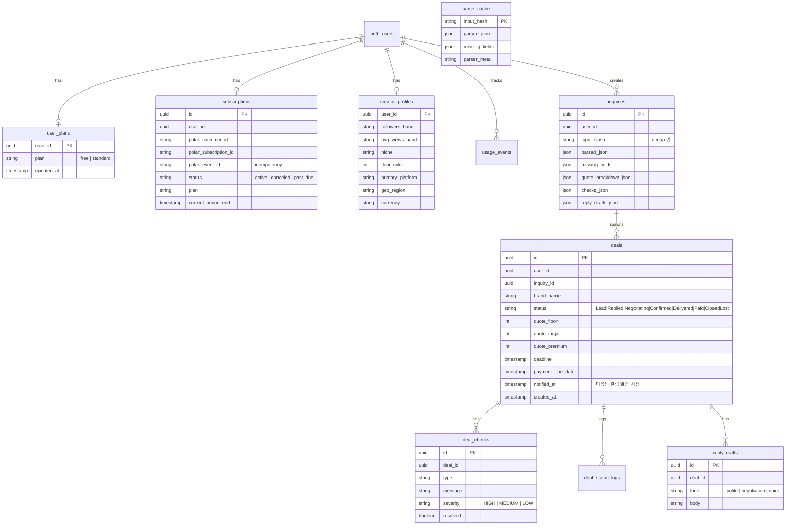
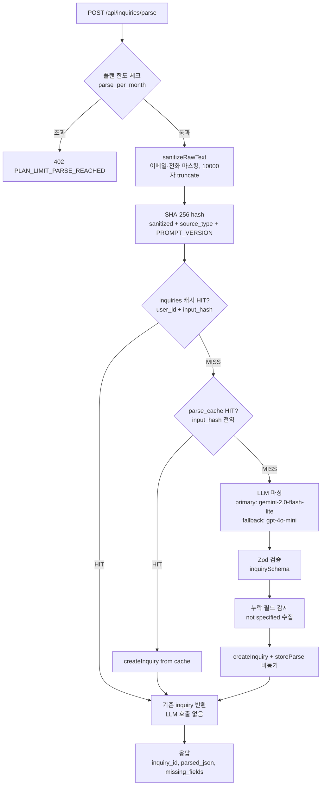
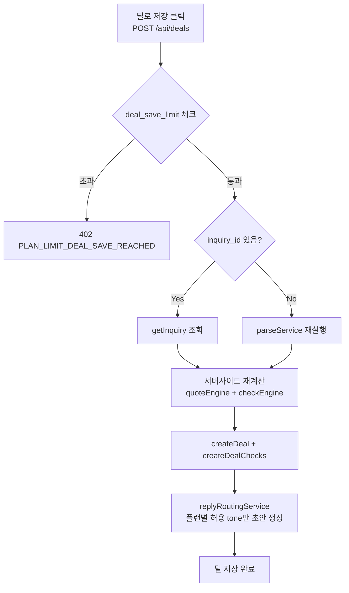
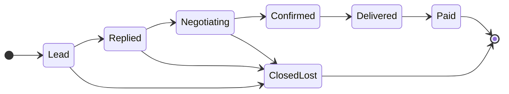
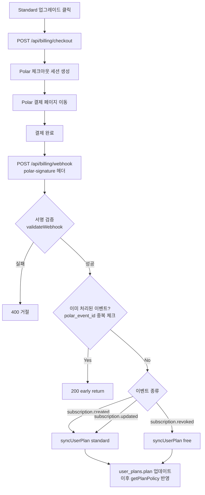
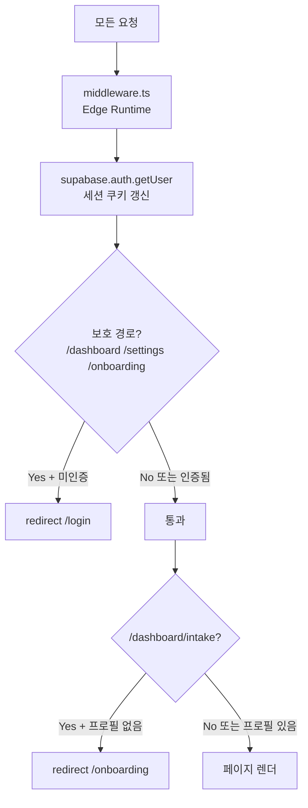
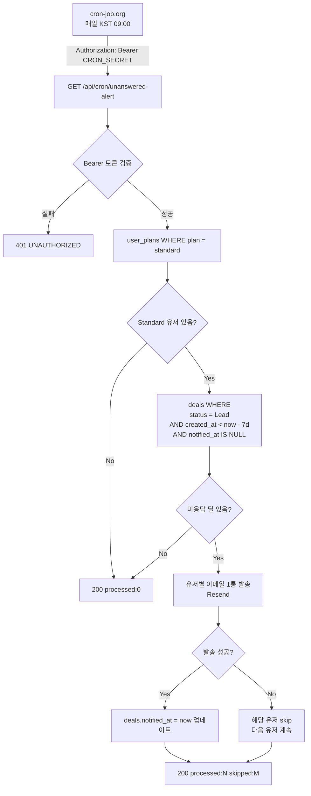
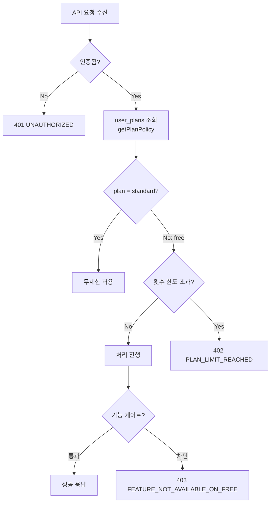

# DELO — 크리에이터 AI 매니저


에이전시 없이 활동하는 크리에이터의 브랜드 협업 운영을 자동화하는 SaaS.
문의 텍스트를 붙여 넣으면 계약 조건 구조화 → 견적 산출 → 체크리스트 → 답장 초안 → 딜 저장까지 원스톱으로 처리한다.

---

## 목차

1. [서비스 개요](#1-서비스-개요)
2. [기술 스택](#2-기술-스택)
3. [아키텍처 다이어그램](#3-아키텍처-다이어그램)
4. [디렉터리 구조](#4-디렉터리-구조)
5. [데이터 모델 (ERD)](#5-데이터-모델-erd)
6. [핵심 플로우 상세](#6-핵심-플로우-상세)
   - 6-A. Parse Pipeline
   - 6-B. Deal 저장 & 상태 머신
   - 6-C. Billing (Polar)
   - 6-D. 인증 & 미들웨어
7. [API 레퍼런스](#7-api-레퍼런스)
8. [플랜 정책](#8-플랜-정책)
9. [로컬 개발 셋업](#9-로컬-개발-셋업)
10. [환경변수 레퍼런스](#10-환경변수-레퍼런스)
11. [테스트 가이드](#11-테스트-가이드)
12. [배포](#12-배포)
13. [코드 작성 패턴 가이드](#13-코드-작성-패턴-가이드)
14. [현재 미구현 / 로드맵](#14-현재-미구현--로드맵)

---

## 1. 서비스 개요

### 무엇을 해결하는가

크리에이터가 브랜드로부터 협업 문의를 받으면, 보통 아래 과정을 수작업으로 처리한다.

- 문의 텍스트(이메일·DM·카카오) 정리 → 계약 조건 파악
- 사용권·독점권·수정 횟수·지급 조건 누락 여부 확인
- 견적 감으로 제시 → 과소 청구 또는 협상 실패
- 답장 문구 매번 새로 작성
- 딜 진행 상황 머릿속으로 추적 → 입금 누락

DELO는 이 흐름을 AI + 구조화된 워크스페이스로 대체한다.

### 타겟 사용자 (ICP)

| 항목 | 내용 |
|------|------|
| 팔로워 규모 | 5만~15만 (소·중형 크리에이터) |
| 활동 패턴 | 월 2~5건 이상 브랜드 협업 직접 처리 |
| 공통점 | 매니저 없음, 협업은 이미 하지만 운영 효율 낮음 |

### 플랜 구조 (현재 구현)

| 플랜 | 가격 | 상태 |
|------|------|------|
| Free | 0원 | 구현 완료 |
| Standard | 12,900원/월 | 구현 완료 (Polar) |
| Pro | 29,900원/월 | **미구현** (Phase 2~3 예정) |
| Business | 79,000원/월 | **미구현** (Phase 3~4 예정) |

---

## 2. 기술 스택

| 레이어 | 기술 | 용도 |
|--------|------|------|
| 프레임워크 | Next.js 15 (App Router) | 풀스택, SSR/RSC |
| 런타임 | React 19, TypeScript 5.8 | |
| DB / 인증 | Supabase (PostgreSQL + Auth) | 데이터 저장, OAuth, RLS |
| 배포 | Cloudflare Workers (via `@opennextjs/cloudflare`) | 엣지 배포 |
| 빌링 | Polar (`@polar-sh/sdk`) | 구독 결제 |
| AI/LLM | OpenAI (gpt-4o-mini), Google (gemini-2.0-flash-lite), Anthropic (claude-sonnet) | 파싱·협상 답장 |
| 이메일 | Resend (`@resend/node`) | Standard 미응답 알림 메일 발송 |
| Cron 스케줄러 | cron-job.org (외부) | `/api/cron/unanswered-alert` 매일 KST 09:00 호출 |
| 분석 | PostHog (34 이벤트), Sentry, Microsoft Clarity | |
| UI | Tailwind CSS + shadcn/ui (Radix UI 기반) | |
| 테스트 | Vitest | 유닛·통합 ~152개 |
| 스타일링 | CSS Variables 다크/라이트 테마 | |

> **주의:** `stripe` 패키지가 package.json에 남아있으나 실제로 사용하지 않는다. Polar로 완전 이전됨 (migration 008). 차후 제거 예정.

---

## 3. 아키텍처 다이어그램

### 전체 시스템 구조

```
┌─────────────────────────────────────────────────────────────────┐
│                    Browser / Mobile                              │
│                  (Next.js Client Components)                     │
└──────────────────────────┬──────────────────────────────────────┘
                           │ HTTPS
┌──────────────────────────▼──────────────────────────────────────┐
│              Cloudflare Workers (Edge)                           │
│         Next.js App Router (Server Components + API Routes)      │
│                                                                  │
│  ┌─────────────┐  ┌──────────────┐  ┌────────────────────────┐  │
│  │  middleware  │  │ API Routes   │  │  Server Components     │  │
│  │  (세션갱신+  │  │ /api/*       │  │  (대시보드, 랜딩 등)    │  │
│  │   경로보호)  │  │              │  │                        │  │
│  └─────────────┘  └──────┬───────┘  └────────────────────────┘  │
└─────────────────────────┬┴────────────────────────────────────┬─┘
                          │                                     │
          ┌───────────────▼──────────────┐        ┌────────────▼──────────┐
          │   Services / Repositories     │        │   External APIs       │
          │                              │        │                       │
          │  services/                   │        │  OpenAI API           │
          │    parse-service.ts          │        │  Google AI API        │
          │    deal-service.ts           │        │  Anthropic API        │
          │    billing-service.ts        │        │  Polar API            │
          │    alert-engine.ts           │        │  Resend API (이메일)  │
          │    reply-generator.ts        │        │  PostHog              │
          │                              │        │  Sentry               │
          │  lib/email.ts (Resend)       │        └───────────────────────┘
          │  repositories/               │
          │    deals-repo.ts             │
          │    inquiries-repo.ts         │
          │    parse-cache-repo.ts       │
          │    subscriptions-repo.ts     │
          │    ...                       │
          └───────────────┬──────────────┘
                          │ Supabase Admin Client (bypasses RLS)
          ┌───────────────▼──────────────────────────────────────┐
          │              Supabase (PostgreSQL)                    │
          │                                                      │
          │  deals  deal_checks  deal_status_logs  reply_drafts  │
          │  inquiries  parse_cache  creator_profiles            │
          │  user_plans  subscriptions  usage_events             │
          └──────────────────────────────────────────────────────┘
```

### 계층 분리 원칙

```
API Route
   │  요청 검증, 인증 확인, plan gate
   ▼
Service
   │  비즈니스 로직 (DB 직접 접근 금지)
   ▼
Repository
   │  Supabase admin client로만 DB 접근
   ▼
Supabase DB (RLS는 브라우저 직접 접근 방어용)
```

> **규칙:** service는 DB를 모르고, repository는 비즈니스 로직을 모른다.

---

## 4. 디렉터리 구조

```
creator-deal-copilot/
│
├── app/                          # Next.js App Router
│   ├── api/                      # API Route Handlers
│   │   ├── account/route.ts      # DELETE /api/account (계정 삭제)
│   │   ├── analytics/event/      # POST (PostHog 서버사이드 브리지)
│   │   ├── billing/
│   │   │   ├── checkout/         # POST (Polar 체크아웃 세션 생성)
│   │   │   └── webhook/          # POST (Polar 웹훅 수신)
│   │   ├── creator-profile/      # GET / POST·PUT (프로필 upsert)
│   │   ├── deals/
│   │   │   ├── [id]/             # GET·PATCH (딜 상세 + 상태 전이)
│   │   │   ├── alerts/           # GET (Standard-only 알림)
│   │   │   └── route.ts          # GET·POST (목록 + 저장)
│   │   ├── cron/unanswered-alert/ # GET (7일 이상 미응답 딜 메일 알림)
│   │   ├── demo/parse/           # POST (비인증 데모 파싱)
│   │   ├── health/               # GET (헬스체크)
│   │   ├── inquiries/
│   │   │   ├── [id]/             # GET (문의 상세)
│   │   │   ├── parse/            # POST ⭐ 핵심 엔드포인트 (계약 불변)
│   │   │   └── route.ts          # GET (문의 목록)
│   │   └── replies/negotiation-ai/ # POST (AI 협상 답장)
│   │
│   ├── auth/callback/            # Supabase OAuth + OTP 콜백
│   ├── dashboard/                # 인증 필요 앱 영역
│   │   ├── deals/[id]/           # 딜 상세 화면
│   │   ├── history/[id]/         # 저장된 파싱 결과 상세 / 초안 수정
│   │   ├── history/              # 파싱 히스토리
│   │   ├── intake/               # 문의 입력 & 파싱 워크스페이스
│   │   ├── settings/             # 플랜·빌링 설정
│   │   ├── layout.tsx            # 온보딩 리다이렉트 로직 포함
│   │   └── page.tsx              # 대시보드 (딜 목록 + 알림)
│   ├── onboarding/               # 크리에이터 프로필 온보딩
│   ├── (public)/pricing/         # 공개 가격 페이지
│   ├── about/, how-it-works/     # SEO 중심 공개 페이지
│   ├── deal/[id]/                # 공개 파싱 결과 상세
│   ├── history/, settings/       # 대시보드 내부로 리다이렉트
│   ├── login/, signup/, parse/   # 인증/체험 진입점
│   ├── privacy/, terms/          # 정책 페이지
│   ├── layout.tsx                # Root layout (테마, analytics, SEO)
│   └── globals.css
│
├── components/
│   ├── dashboard/                # DealCard, AlertPanel, SummaryCards 등
│   ├── intake/                   # IntakeWorkspace, IntakeBrief, IntakeChecks 등
│   ├── landing/                  # LandingCtaButton, LandingProductMockup 등
│   ├── onboarding/               # OnboardingWizard
│   ├── results/                  # ChecksCard, QuoteCard, ReplyCard 등
│   ├── settings/                 # SettingsBillingPanel
│   └── ui/                       # 공용 UI (Button, Card, CopyButton 등)
│
├── services/                     # 비즈니스 로직 (DB 직접 접근 금지)
│   ├── parse-service.ts          # ⭐ 파싱 파이프라인 오케스트레이터
│   ├── parse-llm-service.ts      # LLM 호출 + fallback
│   ├── deal-service.ts           # 딜 저장 + 견적/체크 재계산
│   ├── billing-service.ts        # Polar checkout + webhook 처리
│   ├── alert-engine.ts           # 미응답/마감 임박/연체 알림 계산
│   ├── check-engine.ts           # 계약 체크리스트 생성
│   ├── quote-engine.ts           # 견적 계산
│   ├── reply-generator.ts        # 답장 초안 생성 (템플릿)
│   ├── reply-routing-service.ts  # 플랜별 답장 라우팅
│   ├── reply-template-service.ts # 톤별 답장 템플릿
│   ├── status-transition.ts      # 딜 상태 머신 검증
│   ├── auth-service.ts           # 인증 헬퍼
│   ├── usage-guard.ts            # 플랜/월간 사용량 게이트
│   └── llm-budget-guard.ts       # LLM 일일 비용 한도
│
├── repositories/                 # DB 접근 (Supabase admin client 전용)
│   ├── deals-repo.ts
│   ├── deal-checks-repo.ts
│   ├── deal-status-log-repo.ts
│   ├── inquiries-repo.ts
│   ├── parse-cache-repo.ts
│   ├── reply-drafts-repo.ts
│   ├── creator-profiles-repo.ts
│   └── subscriptions-repo.ts     # syncUserPlan() 포함
│
├── lib/
│   ├── llm/                      # LLM 추상화 레이어
│   │   ├── client-factory.ts     # primary/fallback 프로바이더 선택
│   │   ├── provider.ts           # LLMProvider 인터페이스
│   │   ├── registry.ts           # 프로바이더 등록
│   │   ├── openai-client.ts
│   │   ├── google-client.ts
│   │   ├── anthropic-client.ts
│   │   ├── extract-json.ts       # LLM 응답에서 JSON 추출
│   │   └── prompts/
│   │       ├── parse-inquiry.prompt.ts
│   │       └── negotiation-reply.prompt.ts
│   ├── supabase/
│   │   ├── admin.ts              # createAdminClient() — repo 전용
│   │   ├── server.ts             # createClient() — API route/서버 컴포넌트
│   │   └── client.ts             # 클라이언트 컴포넌트용
│   ├── plan-policy.ts            # ⭐ 플랜 정책 SSOT (여기만 수정)
│   ├── analytics-contract.ts     # ⭐ 34개 이벤트 이름 SSOT
│   ├── analytics.ts              # PostHog 서버사이드 래퍼
│   ├── analytics-client.ts       # 클라이언트 → /api/analytics/event
│   ├── api-response.ts           # successResponse / errorResponse 표준화
│   ├── email.ts                  # Resend 메일 발송 래퍼
│   ├── polar.ts                  # Polar SDK 싱글턴
│   ├── parse-error.ts            # ParsePipelineError 타입
│   ├── inquiry/
│   │   ├── sanitize-raw-text.ts  # 개인정보·노이즈 제거
│   │   └── hash-input.ts         # SHA-256 해시 (dedup 키)
│   └── logger.ts                 # 구조화 로그 (logInfo, logError)
│
├── schemas/
│   └── inquiry.schema.ts         # Zod: InquiryData 검증 스키마
│
├── types/
│   └── inquiry.ts                # InquiryData, ParseInput, CreatorProfile 타입
│
├── supabase/
│   └── migrations/               # 001~010 순서대로 적용
│
├── db/
│   └── schema.sql                # 참조용 스냅샷 (001~006 기준, 최신 아님)
│
├── __tests__/                    # Vitest 테스트 (~52개 파일)
├── middleware.ts                 # 세션 갱신 + 경로 보호
├── vercel.json                   # Vercel 배포 설정 (Cron 포함)
├── .env.example                  # 환경변수 템플릿
└── package.json
```

---

## 5. 데이터 모델 (ERD)



**RLS 정책 요약:**

| 테이블 | 정책 |
|--------|------|
| deals, deal_checks, deal_status_logs, reply_drafts | user_id = auth.uid() |
| inquiries, creator_profiles, usage_events, user_plans, subscriptions | user_id = auth.uid() |
| parse_cache | RLS 없음 — admin client 전용 |

---

## 6. 핵심 플로우 상세

### 6-A. Parse Pipeline (가장 중요한 플로우)

브랜드 문의 텍스트 한 줄이 어떻게 구조화된 데이터가 되는가.



**캐시 3단계 구조:**

| 단계 | 저장소 | 키 | 특징 |
|------|--------|-----|------|
| 1차 | `inquiries` 테이블 | `user_id + input_hash` | 가장 빠름, 사용자별 |
| 2차 | `parse_cache` 테이블 | `input_hash` | 전역, LLM 없이 재생성 |
| 3차 | LLM 호출 | — | 비용 발생, 최후 수단 |

**주의:** `POST /api/inquiries/parse` 의 응답 스키마(`{ inquiry_id, parsed_json, missing_fields }`)는 여러 클라이언트가 의존하므로 **절대 변경 불가**.

---

### 6-B. Deal 저장 & 상태 머신



**딜 상태 머신 (PATCH /api/deals/[id])**



> `services/status-transition.ts`의 `ALLOWED_TRANSITIONS`만 허용. 위반 시 → `400 INVALID_STATUS_TRANSITION`

---

### 6-C. Billing 플로우 (Polar)



---

### 6-D. 인증 & 미들웨어



**API Route 인증 패턴:**

```ts
const supabase = await createClient()                    // lib/supabase/server.ts
const { data: { user } } = await supabase.auth.getUser()
if (!user) return NextResponse.json(errorResponse("UNAUTHORIZED"), { status: 401 })

const admin = createAdminClient()                        // lib/supabase/admin.ts (RLS 우회)
```

---

### 6-E. 미응답 알림 Cron 플로우

Standard 유저가 7일 이상 답장하지 않은 딜에 이메일로 알림을 보낸다.



**중복 발송 방지:** `notified_at IS NULL` 조건으로 이미 알림 발송된 딜은 재발송하지 않는다.

**Cloudflare Workers 배포 환경:** Vercel Cron은 동작하지 않으므로, cron-job.org 외부 스케줄러가 `Authorization: Bearer $CRON_SECRET` 헤더를 포함해 엔드포인트를 직접 호출한다.

---

## 7. API 레퍼런스

### 범례
- 🔒 = 인증 필요 (Supabase session)
- 💎 = Standard 플랜 이상 필요
- ⭐ = 응답 계약 불변 (클라이언트 의존)

| 메서드 | 경로 | 설명 | 비고 |
|--------|------|------|------|
| GET | `/api/health` | 헬스체크 | |
| GET | `/api/cron/unanswered-alert` | 내부 크론 알림 실행 | `Authorization: Bearer $CRON_SECRET` |
| POST | `/api/demo/parse` | 비인증 데모 파싱 | 저장 없음, rate limit 별도 |
| POST | `/api/inquiries/parse` ⭐ | 🔒 문의 AI 파싱 | 플랜 한도 적용, 응답 불변 |
| GET | `/api/inquiries` | 🔒 문의 목록 | |
| GET | `/api/inquiries/[id]` | 🔒 문의 상세 | |
| GET | `/api/deals` | 🔒 딜 목록 | `?status=` 필터, alert summary 포함 |
| POST | `/api/deals` | 🔒 딜 저장 | 플랜 한도 적용, 서버사이드 재계산 |
| GET | `/api/deals/[id]` | 🔒 딜 상세 | checks + drafts + status_logs 포함 |
| PATCH | `/api/deals/[id]` | 🔒 딜 수정 + 상태 전이 | ALLOWED_TRANSITIONS 검증 |
| GET | `/api/deals/alerts` | 🔒💎 알림 목록 | Standard only |
| GET | `/api/creator-profile` | 🔒 프로필 조회 | |
| POST/PUT | `/api/creator-profile` | 🔒 프로필 upsert | |
| POST | `/api/replies/negotiation-ai` | 🔒💎 AI 협상 답장 | Standard only, 예산 가드 |
| POST | `/api/billing/checkout` | 🔒 Polar 체크아웃 세션 | |
| POST | `/api/billing/webhook` | Polar 웹훅 | 서명 검증 필수 |
| POST | `/api/analytics/event` | 🔒 클라이언트 이벤트 수집 | PostHog 서버 경유 |
| DELETE | `/api/account` | 🔒 계정 삭제 | admin.deleteUser + 캐스케이드 |

### 공통 응답 형식

```ts
// 성공
{ data: T }

// 실패
{ code: string, message?: string }
// lib/api-response.ts 의 errorResponse(code, message?) 사용
```

**에러 코드 목록:**

| 코드 | HTTP | 의미 |
|------|------|------|
| `UNAUTHORIZED` | 401 | 인증 없음 |
| `PLAN_LIMIT_PARSE_REACHED` | 402 | 파싱 월 한도 초과 |
| `PLAN_LIMIT_DEAL_SAVE_REACHED` | 402 | 딜 저장 한도 초과 |
| `FEATURE_NOT_AVAILABLE_ON_FREE` | 403 | Free 플랜 미지원 기능 |
| `ALERTS_NOT_AVAILABLE_ON_FREE` | 403 | 알림 Free 미지원 |
| `NEGOTIATION_AI_LIMIT_REACHED` | 402 | AI 협상 한도 초과 |
| `DAILY_BUDGET_GUARD_TRIGGERED` | 429 | LLM 일일 예산 초과 |
| `INVALID_STATUS_TRANSITION` | 400 | 허용되지 않은 딜 상태 전이 |
| `INQUIRY_NOT_FOUND` | 404 | 문의 없음 |
| `NOT_FOUND` | 404 | 리소스 없음 |
| `INVALID_REQUEST` | 400 | 요청 형식 오류 |
| `PARSE_FAILED` | 500 | LLM 파싱 실패 |
| `INTERNAL_ERROR` | 500 | 서버 오류 |

---

## 8. 플랜 정책

**SSOT: `lib/plan-policy.ts`** — 여기 외에는 플랜 제한을 하드코딩하지 않는다.



| 기능 | Free | Standard |
|------|------|----------|
| 월 파싱 횟수 | 5회 | 무제한 |
| 딜 저장 | 10개 | 무제한 |
| Negotiation AI | ❌ | 무제한 |
| 답장 톤 | polite 1가지 | polite·quick·negotiation 3가지 |
| 알림 패널 | ❌ | ✅ |
| 견적 상세 breakdown | ❌ | ✅ |
| 계약 체크 전체 목록 | ❌ | ✅ |
| 미응답 이메일 알림 | ❌ | ✅ |

**플랜 게이트 추가 방법:**

```ts
// 1. lib/plan-policy.ts 에 필드 추가
export type PlanPolicy = {
  new_feature_enabled: boolean;
  ...
}
export const PLAN_POLICIES = {
  free:     { new_feature_enabled: false, ... },
  standard: { new_feature_enabled: true,  ... },
}

// 2. API Route에서 확인
const policy = getPlanPolicy(plan)
if (!policy.new_feature_enabled) {
  return NextResponse.json(errorResponse('FEATURE_NOT_AVAILABLE_ON_FREE'), { status: 403 })
}
```

---

## 9. 로컬 개발 셋업

### 사전 요구사항

- Node.js 20+
- pnpm 또는 npm
- Supabase 계정 (또는 `supabase start` 로컬)
- OpenAI / Google AI API 키 (파싱 테스트용, 최소 1개)

### 1단계: 저장소 클론 및 의존성 설치

```bash
git clone <repo-url>
cd creator-deal-copilot
npm install
```

### 2단계: 환경변수 설정

```bash
cp .env.example .env.local
# .env.local 을 열어 아래 항목 채우기 (최소 셋)
```

최소 동작에 필요한 env (섹션 10 참고):
- `NEXT_PUBLIC_SUPABASE_URL`
- `NEXT_PUBLIC_SUPABASE_ANON_KEY`
- `SUPABASE_SERVICE_ROLE_KEY`
- `OPENAI_API_KEY` 또는 `GOOGLE_AI_API_KEY` (파싱 기능)
- `NEXT_PUBLIC_APP_URL=http://localhost:3000`

### 3단계: Supabase 마이그레이션 적용

```bash
# Supabase 대시보드 → SQL Editor에서
# supabase/migrations/001_*.sql ~ 010_*.sql 순서대로 실행

# 또는 CLI 사용 (로컬 Supabase)
npx supabase db push
```

### 4단계: 개발 서버 실행

```bash
npm run dev
# http://localhost:3000
```

### 5단계: 기능별 추가 셋업 (선택)

| 기능 | 필요 env |
|------|----------|
| Negotiation AI | `ANTHROPIC_API_KEY` 또는 `OPENAI_API_KEY` |
| 결제 (Polar) | `POLAR_ACCESS_TOKEN`, `POLAR_WEBHOOK_SECRET`, `POLAR_PRODUCT_ID` |
| 미응답 알림 이메일 | `RESEND_API_KEY`, `FROM_EMAIL`, `CRON_SECRET` |
| 분석 (PostHog) | `POSTHOG_API_KEY` |
| 에러 추적 (Sentry) | `SENTRY_DSN` |

### Polar 웹훅 로컬 테스트

```bash
# Polar 대시보드에서 웹훅 URL을 ngrok 주소로 설정
ngrok http 3000
# 웹훅 URL: https://xxxx.ngrok.io/api/billing/webhook
```

---

## 10. 환경변수 레퍼런스

| 변수명 | 필수 | 용도 |
|--------|------|------|
| `NEXT_PUBLIC_SUPABASE_URL` | ✅ | Supabase 프로젝트 URL |
| `NEXT_PUBLIC_SUPABASE_ANON_KEY` | ✅ | Supabase anon key (클라이언트) |
| `SUPABASE_SERVICE_ROLE_KEY` | ✅ | Admin client (RLS bypass, 서버만) |
| `NEXT_PUBLIC_APP_URL` | ✅ | 배포 URL (Polar 리다이렉트 등에 사용) |
| `OPENAI_API_KEY` | ✅¹ | GPT-4o-mini (파싱 fallback, 협상 AI primary) |
| `GOOGLE_AI_API_KEY` | ✅¹ | Gemini (파싱 primary) |
| `ANTHROPIC_API_KEY` | | Claude (협상 AI fallback) |
| `POLAR_ACCESS_TOKEN` | 💳 | Polar API 인증 |
| `POLAR_WEBHOOK_SECRET` | 💳 | 웹훅 서명 검증 |
| `POLAR_PRODUCT_ID` | 💳 | Standard 상품 ID (현재 단일) |
| `POSTHOG_API_KEY` | | 이벤트 분석 |
| `SENTRY_DSN` | | 에러 추적 |
| `GOOGLE_SITE_VERIFICATION` | | 구글 서치 콘솔 인증 |
| `NAVER_SITE_VERIFICATION` | | 네이버 서치 어드바이저 인증 |
| `RESEND_API_KEY` | | 미응답 알림 메일 발송 |
| `FROM_EMAIL` | | 발신자 주소 (`noreply@delo-app.com` 기본값) |
| `CRON_SECRET` | | `/api/cron/unanswered-alert` 보호용 Bearer 토큰 |

> ¹ OPENAI 또는 GOOGLE 중 하나 이상 필요. 두 개 다 있으면 primary/fallback 동작.
> 💳 결제 기능 사용 시 필수.

**Cloudflare Workers 환경:** `wrangler.jsonc` 에 public 변수만 두고, 민감 정보(`SUPABASE_SERVICE_ROLE_KEY`, `POLAR_ACCESS_TOKEN`, `RESEND_API_KEY`, `CRON_SECRET`)는 Wrangler secret으로 주입한다. 로컬 개발은 `.env.local` 만 수정.

---

## 11. 테스트 가이드

```bash
# 전체 테스트 실행
npm test

# watch 모드
npm run test:watch

# 커버리지
npx vitest run --coverage
```

### 테스트 파일 구조

```
__tests__/
├── setup.ts                      # 전역 mock 설정
├── mocks/server-only.ts          # server-only 패키지 mock
│
├── parse-service.test.ts         # ⭐ Parse 파이프라인 핵심 케이스
├── parse-llm-service.test.ts     # LLM 호출 + fallback
├── deal-service.test.ts          # 딜 저장 + 재계산
├── billing-service.test.ts       # Polar 웹훅 처리
├── alert-engine.test.ts          # 알림 계산 로직
├── plan-policy.test.ts           # 플랜 정책
├── plan-gating-integration.test.ts  # 플랜 게이트 통합
│
├── inquiries-parse-route.test.ts    # API Route 수준
├── deals-route.test.ts
├── deals-id-route.test.ts
├── deals-alerts-route.test.ts
├── billing-checkout-route.test.ts
├── billing-webhook-route.test.ts
├── creator-profile-route.test.ts
│
└── ...
```

### 새 기능 테스트 작성 규칙

- Repository는 mock (실제 DB 불필요)
- Service 유닛 테스트: repository를 vi.mock()으로 교체
- API Route 테스트: NextRequest 직접 생성, auth mock 포함
- plan-policy 테스트: `PLAN_POLICIES` 직접 import해서 검증

---

## 12. 배포

### Vercel (기본 배포)

```bash
# vercel.json 설정 이미 있음
git push origin main
# Vercel 자동 배포 또는 vercel --prod
```

환경변수는 Vercel 대시보드 → Settings → Environment Variables에 등록.

현재 `vercel.json` 에 아래 크론이 포함되어 있다.

```json
{
  "crons": [
    {
      "path": "/api/cron/unanswered-alert",
      "schedule": "0 0 * * *"
    }
  ]
}
```

UTC `00:00` 실행이므로 한국 시간 기준 오전 `09:00` 에 미응답 딜 알림 작업이 수행된다.

### Cloudflare Workers (엣지 배포)

```bash
# 빌드 + 배포
npm run deploy
# = opennextjs-cloudflare build && opennextjs-cloudflare deploy

# 로컬 미리보기
npm run preview
```

**Cloudflare 주의사항:**
- `wrangler.jsonc` 에 env vars 별도 관리 필요 (public 변수는 `vars`, 민감 정보는 `wrangler secret put`)
- `server-only` 패키지 사용 모듈은 Edge 런타임 호환 확인 필요
- Cloudflare Workers는 Node.js crypto 대신 Web Crypto API 사용
- Vercel Cron은 Cloudflare에 자동 전달되지 않음 → **현재 cron-job.org 외부 스케줄러로 운영 중**
  - `Authorization: Bearer $CRON_SECRET` 헤더 포함해 `GET /api/cron/unanswered-alert` 호출
  - 스케줄: `0 0 * * *` (UTC 00:00 = KST 09:00)

---

## 13. 코드 작성 패턴 가이드

### 새 API 엔드포인트 추가하는 방법

```ts
// app/api/my-feature/route.ts
import { NextResponse } from "next/server"
import { createClient } from "@/lib/supabase/server"
import { createAdminClient } from "@/lib/supabase/admin"
import { successResponse, errorResponse } from "@/lib/api-response"
import { getPlanPolicy } from "@/lib/plan-policy"

export async function POST(req: Request) {
  // 1. 인증 확인
  const supabase = await createClient()
  const { data: { user } } = await supabase.auth.getUser()
  if (!user) {
    return NextResponse.json(errorResponse("UNAUTHORIZED"), { status: 401 })
  }

  // 2. 플랜 확인 (필요 시)
  const admin = createAdminClient()
  const { data: planRow } = await admin
    .from("user_plans").select("plan").eq("user_id", user.id).single()
  const policy = getPlanPolicy(planRow?.plan ?? "free")
  if (!policy.some_feature_enabled) {
    return NextResponse.json(
      errorResponse("FEATURE_NOT_AVAILABLE_ON_FREE"), { status: 403 }
    )
  }

  // 3. 비즈니스 로직은 service로 위임
  const result = await myFeatureService(user.id, ...)

  return NextResponse.json(successResponse(result))
}
```

### Repository 패턴

```ts
// repositories/my-repo.ts
import "server-only"
import { createAdminClient } from "@/lib/supabase/admin"

export async function getMyData(userId: string) {
  const admin = createAdminClient()
  const { data, error } = await admin
    .from("my_table")
    .select("*")
    .eq("user_id", userId)
  if (error) throw error
  return data
}
```

### Analytics 이벤트 추가 방법

```ts
// 1. lib/analytics-contract.ts 에 이벤트 이름 추가 (SSOT)
export const EVENTS = {
  ...
  my_new_event: "my_new_event",
}

// 2. 서버사이드 (service, API route)
import { trackEvent } from "@/lib/analytics"
trackEvent(userId, EVENTS.my_new_event, { key: "value" })

// 3. 클라이언트사이드 (React component)
import { trackClientEvent } from "@/lib/analytics-client"
await trackClientEvent(EVENTS.my_new_event, { key: "value" })
```

### LLM 호출 패턴

```ts
// 새 LLM 기능 추가 시
import { getClientForTask } from "@/lib/llm/client-factory"

const client = getClientForTask("my_task") // primary/fallback 자동 선택
const result = await client.complete(prompt)
// 항상 llm-budget-guard 통과 후 호출
```

---

## 14. 현재 미구현 / 로드맵

새 팀원이 "이건 왜 없지?" 하고 만들기 시작하면 안 되는 항목들.

### Phase 1 미구현 (현재 sprint)

| 항목 | 이유 미구현 | 예상 작업 |
|------|------------|-----------|
| `stripe` 패키지 제거 | 잔존만 됨, 기능은 없음 | 30분 |
| `db/schema.sql` 최신화 | 007~010 마이그레이션 반영 안 됨 | 1시간 |

### 최근 반영된 업데이트 (2026-03 기준)

- 공개 가격 페이지 `/pricing` 추가
- Resend 기반 미응답 딜 알림 메일 발송 구현 (`lib/email.ts`, `app/api/cron/unanswered-alert/`)
- `supabase/migrations/010_add_deal_notified_at.sql` 로 알림 중복 발송 방지 필드 추가
- cron-job.org 외부 스케줄러 연결 완료 (매일 KST 09:00, `Authorization: Bearer $CRON_SECRET`)
- 랜딩 nav 가격 링크 제거 (서비스 체험 전 가격 노출 → 이탈 유발)
- 앱 내 페이월 흐름 추가: 파싱/저장 한도 초과 시 에러 대신 업그레이드 유도 UI 표시

### Phase 2~3 계획 (3~6개월)

- Standard 플랜 고도화 (도용 탐지, 트렌드 Top3, 카카오 알림톡)
- Pro 플랜 출시 (29,900원, 계약서 AI 초안, 칸반 뷰, 인보이스 PDF)
- `POLAR_PRODUCT_ID` 멀티플랜 대응 (현재 단일 상품 ID)

### Phase 4+ (6개월~)

- React Native (Expo) 모바일 앱
- Business 플랜 (79,000원, 팀 공유, 전자서명)
- 일본어 지원 (i18n)
- Enterprise

### 알아두면 좋은 기술 부채

| 항목 | 위치 | 설명 |
|------|------|------|
| `stripe` 잔존 | `package.json` | 사용 안 함, 번들에 포함됨 |
| `db/schema.sql` 스냅샷 미동기화 | `db/schema.sql` | 001~006 기준, 007~010 반영 안 됨 |
| 단일 Polar 상품 ID | `POLAR_PRODUCT_ID` | 멀티플랜 시 구조 변경 필요 |
| 라우트 리다이렉트 이중화 | `app/settings/`, `app/history/` | 공개 경로가 대시보드 경로로 리다이렉트됨 |
| `vercel.json` cron 항목 잔존 | `vercel.json` | Cloudflare Workers 배포 환경에선 동작 안 함, 실제 스케줄러는 cron-job.org |

---

## 기여 가이드

1. `main` 브랜치에서 feature 브랜치 분기
2. `npm test` 통과 확인 후 PR
3. API 응답 계약 변경 시 담당자 확인 필수 (`/api/inquiries/parse` 특히)
4. 플랜 정책 변경은 `lib/plan-policy.ts` 만 수정, 다른 곳에 하드코딩 금지
5. DB 변경 시 `supabase/migrations/` 에 순번 마이그레이션 파일 추가 (`db/schema.sql` 은 레퍼런스용이라 별도 업데이트)
